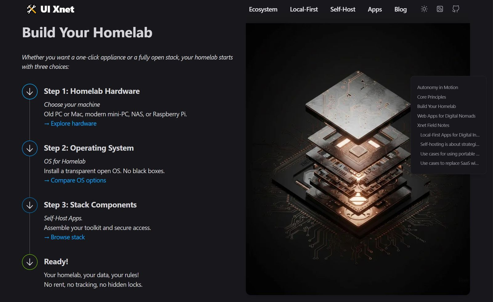

# 🚀 UI XNET — Astrojs Playground


**Open-source template** using **Astrojs v4** and **Tailwind CSS v4**.   

Playground with content from Homelab—Digital Nomad.

[🌀 gigamaster.github.io/xnet](https://gigamaster.github.io/xnet/) 


<br>



<br>

## Features

- ✅ **Astro v4** with improved performance and features
- ✅ Integration with **Tailwind CSS** ([@astrojs/tailwind](https://docs.astro.build/en/guides/integrations-guide/tailwind/)).
- ✅ Supports **Dark mode**.
- ✅ **IconLocal** inline svg workaround to Sharp.
- ✅ **Icon src from Inocify**.
- ✅ **Image optimization** ([astro:assets](https://docs.astro.build/en/guides/assets/) with Sharp by default).
- ✅ **Open Graph tags** for social media sharing
- ✅ **Fonts optimization** at build time ([subfont](https://www.npmjs.com/package/subfont)).
- ✅ **Production-ready** scores in [Lighthouse](https://web.dev/measure/) and [PageSpeed Insights](https://pagespeed.web.dev/)
- ✅ **GitHub Pages** deploy (pnpm or github workflow)

Commented out due to build issues:

> [!CAUTION]
> Commented out due to build issues: **Fast and SEO friendly blog** with automatic **RSS feed** ([@astrojs/rss](https://docs.astro.build/en/guides/rss/)).
> Generation of **project sitemap** based on your routes ([@astrojs/sitemap](https://docs.astro.build/en/guides/integrations-guide/sitemap/)).

## Getting started

### Project structure

Folders and files:

```
/
├── data/
|   └── blog/
|       ├── post-slug-1.md
|       └── ...
├── public/
│   ├── robots.txt
│   ├── favicon.ico
│   └── favicon.png
├── src/
│   ├── assets/
│   │   ├── images/
|   |   └── styles/
|   |       └── base.css
│   ├── components/
│   │   ├── atoms/
│   │   ├── blog/
│   │   ├── core/
|   |   └── widgets/
|   |       ├── Header.astro
|   |       ├── Footer.astro
|   |       └── ...
│   ├── layouts/
│   |   |── BaseLayout.astro
│   |   └── ...
│   ├── pages/
│   |   ├── [...blog]/
|   |   |   ├── [...page].astro
|   |   |   └── [slug].astro
│   |   ├── [...categories]/
|   |   |   └── [category]/
|   |   |       └── [...page].astro
│   |   ├── [...tags]/
|   |   |   └── [tag]/
|   |   |       └── [...page].astro
│   |   ├── index.astro
|   |   ├── 404.astro
|   |   └-- rss.xml.js
│   ├── utils/
│   └── config.mjs
├── package.json
└── ...
```

Astro looks for `.astro` or `.md` files in the `src/pages/` directory. Each page is exposed as a route based on its file name.

Components are used for page's hero and re-usable elements `src/components/` (CardSmall, CardLink, IconLocal, Thumb, etc.)


> [!TIP]
> Any static assets, like images, can be placed in the `public/` directory if they do not require any transformation or in the `assets/` directory if they are imported directly.

<br>

### Commands

All commands are run from the root of the project, from a terminal:

| Command           | Action                                       |
| :---------------- | :------------------------------------------- |
| `npm install`     | Installs dependencies                        |
| `npm run dev`     | Starts local dev server at `localhost:3000`  |
| `npm run build`   | Build your production site to `./dist/`      |
| `npm run preview` | Preview your build locally, before deploying |
| `npm run preview` | Deploy to Github PAges                       |

PNPM

| Command           | Action                                       |
| :---------------- | :------------------------------------------- |
| `pnpm install`    | Installs dependencies                        |
| `pnpm dev`        | Starts local dev server at `localhost:3000`  |
| `pnpm build`      | Build your production site to `./dist/`      |
| `pnpm preview`    | Preview your build locally, before deploying |
| `pnpm deploy`     | Deploy to Github PAges                       |

<br>

### Configuration

Basic configuration file: `./src/config.mjs`

```javascript
export const SITE = {
  name: "Example",
  
  origin: "https://example.com", // Change this deploy to Github Pages: UserName.github.io
  basePathname: "/", // deploy to Github Pages: /RepoName

  title: "Example - This is the homepage title of Example",
  description: "This is the homepage description of Example",

  googleAnalyticsId: false, // or "G-XXXXXXXXXX",
  googleSiteVerificationId: false // or some value,
};

export const BLOG = {
  disabled: false,
  postsPerPage: 4,

  blog: {
    disabled: false,
    pathname: 'blog', // blog main path, you can change this to "articles" (/articles)
  },

  post: {
    disabled: false,
    pathname: '', // empty for /some-post, value for /pathname/some-post 
  },

  category: {
    disabled: false,
    pathname: 'category', // set empty to change from /category/some-category to /some-category
  },

  tag: {
    disabled: false,
    pathname: 'tag', // set empty to change from /tag/some-tag to /some-tag
  },
};


```

<br>

### Deploy

#### Deploy to production (manual)

You can create an optimized production build with:

```shell
npm run build
```

However GitHub workflows/deploy.yml uses PNPM
Node 20 to avoid depndencies conflict Linux/Windows

```shell
pnpm build
```

Now, your website is ready to be deployed. All generated files are located at
`dist` folder, which you can deploy the folder to any hosting service you
prefer. Or use `deploy` for GitHub Pages `gh-pages -d dist -t true `

```shell
pnpm deploy
```

#### Deploy to Vercel

Clone this repository on own GitHub account and deploy to Vercel:

[](https://vercel.com/new/clone?repository-url=https%3A%2F%2Fgithub.com%2Fgigamaster%2Fxnet)


<br>

## Changelog

- *Project*:
  - Update Astro, Tailwind, and dependencies
  - Reduce the complexity in folders
  - Create simple and clear strategy to get template updates
  - Move specific configurations to a specialized file
  - Fix some bugs with prettier
  - Make the use of images clean and intuitive
  - Refactor Local Icon Pipeline
  - Removed astro-icon integration  
    Eliminated dependency on external SVG processing which was causing SVGO minification errors and broken icon renders in production.
  - Implemented LocalIcon component  
    Switched to a local-first architecture using Vite's  loader `{ query: '?raw' }`  
    This ensures SVG source code is injected into the HTML exactly as designed, with no "black-box" processing.
  - Performance & Resilience  
    Icons are now inlined at build time, preventing 404 errors on GitHub Pages/Netlify and ensuring zero Layout Shift (CLS).
  - Centralized Styling  
    Global icon sizing and color are now managed via `.local-icon` svg in base.css  
    allowing for easy Tailwind integration while maintaining clean SVG source files.
  - Removed Netlify ( free tier too limited for a static site)
- *SEO*:
  - Support SEO meta-tags (title, description, canonical, social sharing, ...)
- *Blog*:
  - Fast and SEO friendly blog
  - Categories and tags.
  - Improve blog design
  - Create component or utilities for latest posts
  - Create component or utilities for related posts
  - Add *shortcodes* or *embed* functions to posts in Markdown: (eg video, tweet...)
- *Widgets*:
  - Tailwind components (Features, Contact, Call to Actions, Content, FAQs...)
  - Create external library or place with useful Tailwind components

### Icon Maintenance  

> [!TIP]  
> Drop the .svg into src/assets/icons/  
> Ensure it has a viewBox attribute  
> Reference the filename in the items array  

<br>

## 🛠 Local AI Browser Compatibility (January 2026)

This table tracks support for the three pillars of in-browser autonomy: **Built-in Models** (Native), **Web-LLM** (WASM/WebGPU), and **Hardware Acceleration**.

| Feature | Chrome / Edge | Firefox | Safari | Notes |
| :--- | :--- | :--- | :--- | :--- |
| **Built-in AI** (`window.ai`) | ✅ **Stable** (v140+) | 🧪 **Opt-in** | ❌ **OS-Bound** | Chrome uses Gemini Nano (now with CPU support). Firefox testing "AI Window." |
| **Web-LLM / WASM** | ✅ Full Support | ✅ Full Support | ✅ Full Support | Runs models like Llama/Mistral via `WebAssembly`. No browser lock-in. |
| **WebGPU Acceleration** | ✅ Win/Mac/Linux | ✅ Win/Mac (v145+) | ✅ macOS/iOS (v26+) | The "Engine" for fast local AI. Now stable across all major desktop OS. |
| **Offline Persistence** | ⚠️ Managed by OS | ✅ **User-Controlled** | ⚠️ Managed by OS | Chrome may auto-delete models if disk space is low (<10GB). |
| **Privacy Toggle** | ✅ Feature Flags | ✅ **Global Kill-Switch** | ⚠️ Privacy Cloud | Firefox (Q1 2026) includes a permanent "AI Kill-switch" for all features. |

### Architecture Breakdown


* **Sovereign Recommendation:** Use **Web-LLM (WASM/WebGPU)** for mission-critical tools. Since you control the model file, the browser cannot "uninstall" your AI while you are offline.
* **Convenience Path:** Use **Built-in AI (Gemini Nano)** for lightweight tasks like proofreading or summarization when running on Chrome.

> [!IMPORTANT]
> One major change in the last few months is that Chrome 140+ now supports running Gemini Nano on CPUs. Previously, you needed a powerful GPU with 4GB of VRAM.


```js
// Check for Built-in AI
await window.ai?.languageModel?.availability();

// Check for WebGPU (The local AI engine)
const adapter = await navigator.gpu?.requestAdapter();
console.log(adapter ? "WebGPU Ready" : "WebGPU Not Supported");
```

> [!NOTE]
> Learn how to use the new built-in [AI in Chrome](https://developer.chrome.com/docs/ai), to enable your web app to translate, summarize, write, and rewrite content [Practical built-in AI](https://www.youtube.com/watch?v=CjpZCWYrSxM) and free, local AI in your browser [Chrome's built-in Prompt API](https://www.youtube.com/watch?v=YkUcxX49Rqw) 

## Contributing

If you have any idea, suggestions or find any bugs, feel free to open a discussion, an issue or create a pull request. 


## Acknowledgements

Initially created by [onWidget](https://onwidget.com), edited by [Gigamaster](https://github.com/gigamaster/xnet).

## License

**AstroWind** is licensed under the MIT license — see the [LICENSE](https://github.com/gigamaster/xnet/blob/main/LICENSE.md) file for details.
